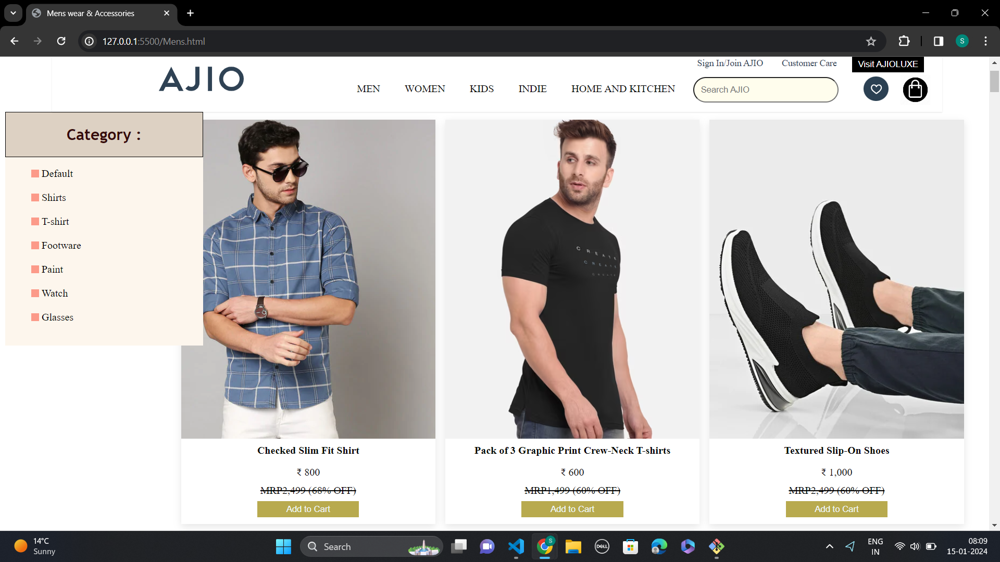
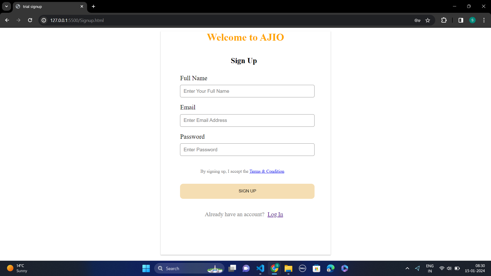
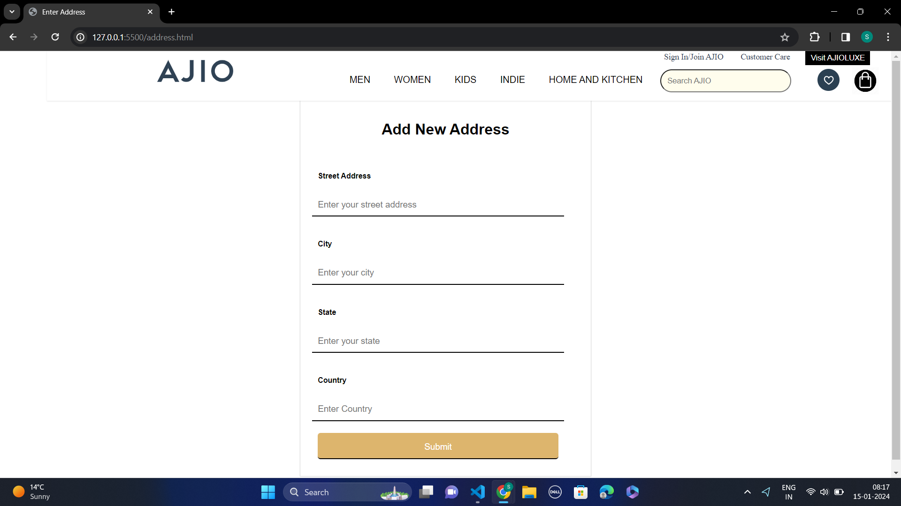
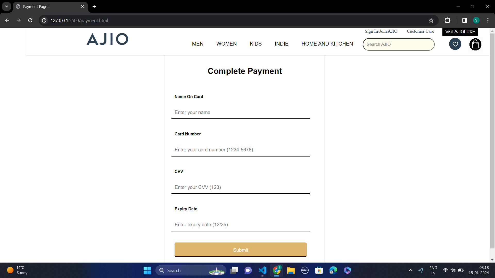

<h1>Clone of Ajio.com</h1>

Home Page:
home page images

To make this page, we used basics of HTML, CSS, Javascript. To store data, we took the help of local storage. We used functionalities like swiper, slider, pagination, navigation etc. We have also included navbar and footer section which is working perfectly fine.

Product Page:
one of the product pages image

To create product page, we stored the data in array of objects. We used functionalities like sorting, filtering, adding to cart(with the use of local storage), total items etc. All these have been completed with HTML, CSS , Javascript only.

Login/Signup Page:
login page image

In this section, we used form tag. We stored the user data in local storage and to login, we matched the data from there.

Cart Page:
cart page image

In cart section, we fetched the data from local storage. Using javascript, we implemented functionalities like delete, increase or decrease the quantity of product, total amount , coupon application, payment gateway etc.

Address and Payment Page:

address image

payment image

When we will enter our address and click on submit button, it will redirect to payment page and after filling all the details correctly, it will redirect to OTP page and after entering OTP, our payment process will be completed.

Challenges Faced:
merging of codes was one of the challenges. Also we were working remotely so sometimes it was challenging to match the time.

Thanks to all the team members, who supported in this project.

This is a brief summary of my project. We have learnt so many things during the completion of the project. We learnt how to coordinate with team members and respect each-others time.
